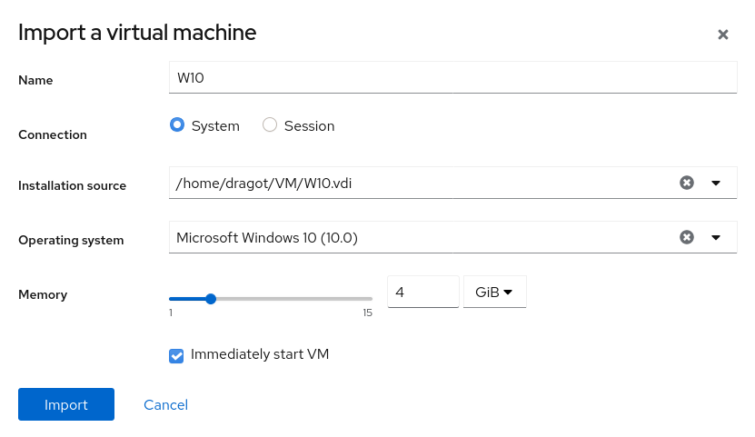

# KVM

## Installation de KVM

```shell
# apt install -y qemu-system libvirt-clients libvirt-daemon-system libvirt-daemon-driver-qemu virt-manager ssh-askpass
```

Ajout de l'utilisateur dans le groupe libvirt

```shell
# adduser <your user> libvirt
```

## Management des VM avec cockpit

```shell
# apt install -y cockpit
```

Une fois run, aller dans un web browser et aller sur :

```shell
http://<ip server ou name server>:9090
```


Documentation
https://cockpit-project.org/guide/latest

## Creer une VM avec Cockpit

Aller dans cockpit et dans l'onglet "Virtual Machines"


Puis creer la VM en cliquant sur le bouton "Create VM" et en renseigant les besoins


En cas d'erreur :

<span style="color:red">
ERROR Requested operation is not valid: network 'default' is not active Domain installation does not appear to have been successful. If it was, you can restart your domain by running: virsh --connect qemu:///system start Ubuntu otherwise, please restart your installation.
</span>


Il faut créer une instance DHCP et DNS. Pour cela, on on configure virsh en defaut

```shell
# virsh net-start default 
```

Puis on redémarre le service libvirtd

```shell
# systemctl restart libvirtd
```

On accede a l'interface d'administration de la vm en cliquant dessus.


## Connexion à la VM

Il existe différente manière de ce connecter à la VM.

* VNC
* Console
* Remote Viewer

### VNC
>Le Virtual Network Computing (VNC) permet un acces simple à la VM via sa console d'administration. Cependant, sa configuration et sa praticité reste limité.

### Console
>Comme son nom l'indique, la connexion Console permet d'acceder au shell de la VM. Tres utile pour le debugage ou en cas de "Freeze" de la VM.

### Remote Viewer
>Le Remote Viewer est la connexion la plus poussé. Elle permet la connexion à la VM comme si c'était un réel poste de travail. On télécharge un fichier de connexion unique qui, une fois quitté, se supprime. Cela permet une connexion sécurisé entre l'hôte et la machine. (nécessite le package virt-viewer)
>De plus, il est possible de permettre une connexion Remote Viewer continue via l'application "Remote Viewer" sous Debian. Il suffit de suivre les information de connexion dans le detail de la VM dans l'onglet "Remote Viewer" et dans l'application bureau "Remote Viewer" de les renseingers. (ex : spice://127.0.0.1:5900)

## Importer une VM

Cliquer sur le bouton "Import VM"


Puis, entrer les paramètres pour démarrer la VM



